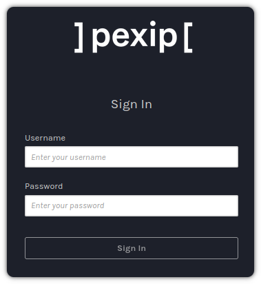
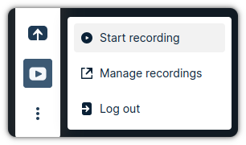
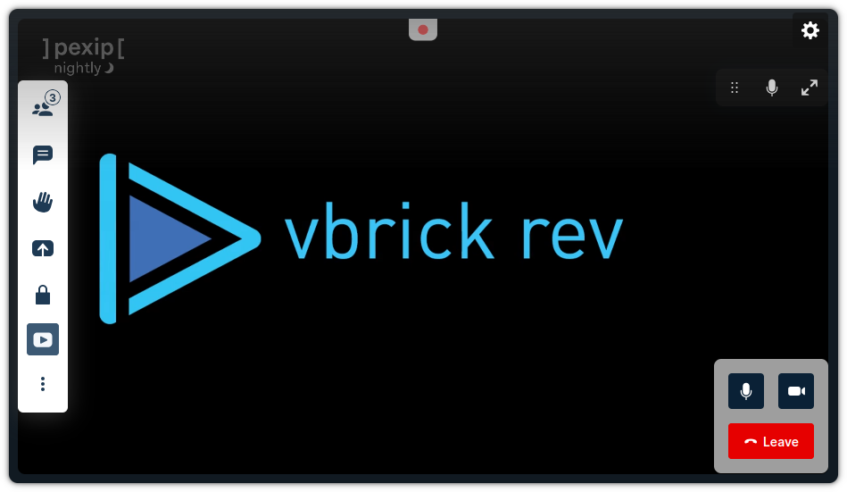

# Plugin: Recording for Vbrick

This plugin allow the user to record a conference in the Vbrick platform. Once
the user click on the recording button, Vbrick will join to the VMR as a SIP/RTMP
participant and will record the call.

## Quick Start Configuration

[Configuration helper page](dist/branding-helper.html)

## How to use

The host user will see a new button in the toolbar and the first time that the
user click on it, the plugin will ask for the user to login.

<div align="center">


</div>

When the user click on that button, a dialog will appear to introduce the user
credentials:

<div align="center">



</div>

After the user introduce the credentials, the user will be able to start the
recording:

<div align="center">



</div>

When the user click on the recording button, the recording will start:

<div align="center">



</div>


## Vbrick Configuration

### API Key

You must add an OAuth API Key This plugin uses an OAuth login flow to authenticate with Vbrick. Follow the steps outlined in the Vbrick documentation to [Create an API Key](https://revdocs.vbrick.com/docs/create-an-api-key):

1. Open Vbrick webpage. This is the same that you have to define in the url.
2. Go to `ADMIN > System Settings > API Keys`.
3. Click on `+ Add Key`.
4. Introduce the following parameters:

   - **name:** It's only a label to identify the key.
   - **key:** It's the value that we will use as `client_id` in the configuration.
   - **authorized redirect uris:** This is the `redirect_uri` in the configuration and should be in the following **exact** format, replacing `<pexip-domain>` with the URL of your Pexip deployment and `<branding-path>` with the [web app path](https://docs.pexip.com/admin/branding_paths.htm) where this plugin will be included.

     `https://<pexip-domain>/<branding-path>/oauth-redirect`
5. Click on `Create`.

## Pexip Infinity Configuration

In order to use this plugin for recording our Pexip deployment should comply with the following requirements:

### SIP Recording

1. All the VMRs to record should contain a **SIP alias**. For example, if we
   have a VMR with alias `meet` in pexipdemo.com. We should also have another
   with the following format `meet@pexipdemo.com`.
2. You will need to configure the call routing to accept **SIP incoming**
   INVITES. Go to the Pexip Management node and create a new call routing
   (Services > Call Routing).

### RTMP Recording

1. You will need to configure the call routing to allow **RTMP Outgoing** calls. The Destination alias match should be a regex matching the the RTMP Recorder's domain


## Plugin Configuration

### Option 1. Use configuration tool

Use the [Branding helper page](dist/branding-helper.html) to generate a plugin configuration and add it to a [branding package](https://docs.pexip.com/admin/customize_clients.htm) zip file.

*If building from source you may need to run `npm run build && npm run build:helper` to generate this file*

### Option 2. Manual

You have to define a configuration file in `public/config.json` before building using `npm run build` *(or manually add to the `/dist` folder after building)*

Here is an example of configuration:

```json
{
  "vbrick": {
    "url": "https://<vbrick-domain>",
    "client_id": "<vbrick-client-id>",
    "redirect_uri": "https://<pexip-domain>/<branding-path>/oauth-redirect"
  },
  "recording_type": "sip",
  "infinity": {
    "sip_domain": "<pexip-domain>"
  }
}
```

You have to define the following parameters under the `vbrick` section:

- **url:** The Vbrick environment to use.
- **client_id:** The key to access Vbrick.
- **redirect_uri:** Indicates where to redirect after a successful
  authentication. The domain of this URL take into account that we need to
  specify the same domain as the one used for our app and the branding.

#### SIP Recording

In the `infinity` section we only have one parameter:

- **sip_domain:** Indicates the domain to use in the SIP URI to make the
  recording. Vbrick will establish call to
  `sip:<conference_alias>@<sip_domain>`.


#### RTMP Recording

By default this plugin records via SIP (Video Conference Recording), which is a Vbrick Rev Cloud-only feature. Vbrick On-Prem has a separate RTMP Recorder Service that works with this plugin *(contact your Vbrick Customer Success Manager for more information)*.

To configure:

1. Change the `recording_type` value in `config.json` from `sip` to `rtmp`
2. Add the following section to `config.json`

```json
  "recorder": {
    "url": "https://<rtmp-recorder-domain>",
    "route": "<route>",
    "display_name": "Vbrick Recorder",
    "legacy_dialout_api": false
  }
```

You have to define the following parameters under the `recorder` section:

- **url:** the URL of the Vbrick On-Prem RTMP Recorder service.
- **route:** The `route` that corresponds to the manual recording settings configured in the Recorder Service (default: `vmr`)
- **display_name:** The name of the recorder shown in the participant list
- **legacy_dialout_api:** Whether to use 'rtmp' or 'auto' for the [dial out protocol](https://docs.pexip.com/api_client/api_rest.htm#dial)

#### Packaging

To add the plugin to a a branding package:

1. Create a folder `plugins/vbrick/` relative to the `manifest.json` file
2. Put the contents of the `dist` folder into the `vbrick` folder
3. Add a `plugins` section to the JSON file and point to the plugin's `index.html` file:

  ```json
    "plugins": [
      {
        "src": "plugins/vbrick/index.html",
        "sandboxValues": ["allow-same-origin","allow-popups","allow-forms"]
      }
    ]
  ```
  4. Ensure that `"handleOauthRedirects"` is set to `true`

## Development

### Configuration

The development server reads configuration values from `vite.json` instead of `config.json` during development.

1. Make a copy of `example.vite.json` and rename to `vite.json`
2. Update `vite.json` as per the [Plugin Configuration](#plugin-configuration) steps.
3. Update  `infinity_url` and `branding_path` with the URL of your pexip deployment and an existing Web app path *(it doesn't need to have the vbrick plugin installed yet)*
4. When following the [configuring the Vbrick API Key](#api-key) steps add `https://localhost:5173/<branding-path>/oauth-redirect` to the list of "Authorized Redirect URIs"

### Run the plugin

The first step is to download and compile all the dependencies:

```
npm install
```

Now we can launch the development server:

```
npm start
```

### Build the plugin

We can generate the `dist` folder with the build with the following command:

```
npm build
```

### Build the helper utility page

After running `npm build` we can generate a helper HTML page (`builder/branding-helper.html`) that automatically creates a `config.json` file in the correct format and adds the plugin to a branding zip file by running this command:

```
npm run build:helper
```

